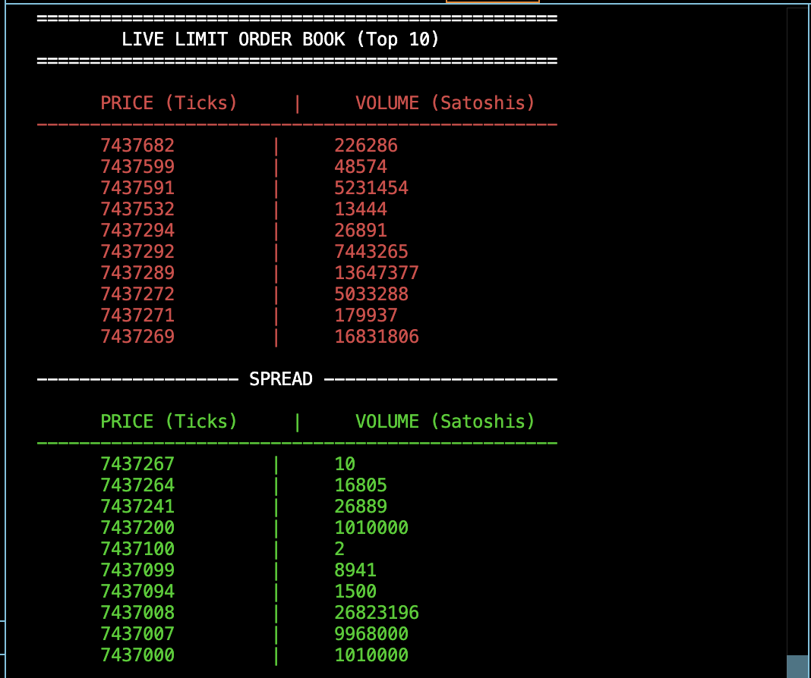
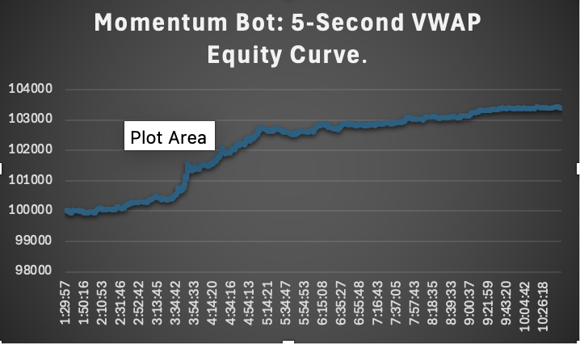

# High-Frequency Limit Order Book & Algorithmic Trading Engine

A custom-built quantitative trading architecture featuring a low-latency C++17 matching engine and a networked Python algorithmic trading bot. The system ingests live WebSocket data from the Coinbase Pro API, processes it through a proprietary TCP network layer, and executes a time-aggregated momentum strategy.



## 🧠 System Architecture

This project is separated into two distinct microservices communicating via TCP sockets:

1. **The Matching Engine (C++)**
   - Built from scratch in C++17 for maximum execution speed.
   - Implements a Price/Time priority Queue using `std::map` and `std::vector` to maintain the Limit Order Book.
   - Features an ANSI-rendered terminal UI to visualize live spread, asks, and bids.
   - Acts as a local TCP Server, processing JSON payloads safely with crash-resistant coalescing logic.

2. **The Algorithmic Bot (Python)**
   - Ingests a firehose of live WebSocket `match` data from Coinbase.
   - Acts as a TCP Client, piping live market data to the C++ engine and awaiting cryptographic ACKs.
   - Implements an Object-Oriented state machine (`MomentumBot`) to track portfolio Net Worth (Fake USD/BTC).
   - **The Strategy:** Aggregates microsecond noise into 5-Second VWAP (Volume-Weighted Average Price) candles. Executes momentum breakout scalps when the live price deviates significantly from the rolling window average.

## 📈 Performance Tracking

The bot features a built-in CSV logger that tracks portfolio state every 5 seconds. Below is a sample equity curve from a live market simulation:



## 🛠️ Tech Stack
* **Core Engine:** C++17, Standard Template Library (STL)
* **Networking:** TCP Sockets (C++ `sys/socket.h`, Python `socket`), WebSockets (`websockets`)
* **Data Parsing:** JSON (`nlohmann::json` in C++, `json` in Python)

## 🚀 How to Run Locally

1. **Compile the C++ Engine:**
   ```bash
   clang++ -std=c++17 -o main *.cpp

2. **Start the Engine (Terminal 1):**
    ```bash
    ./main

3. **Start the Trading Bot (Terminal 2):**
    ```bash
    python3 -m venv venv
    source venv/bin/activate
    pip install websockets
    python3 feeder.py